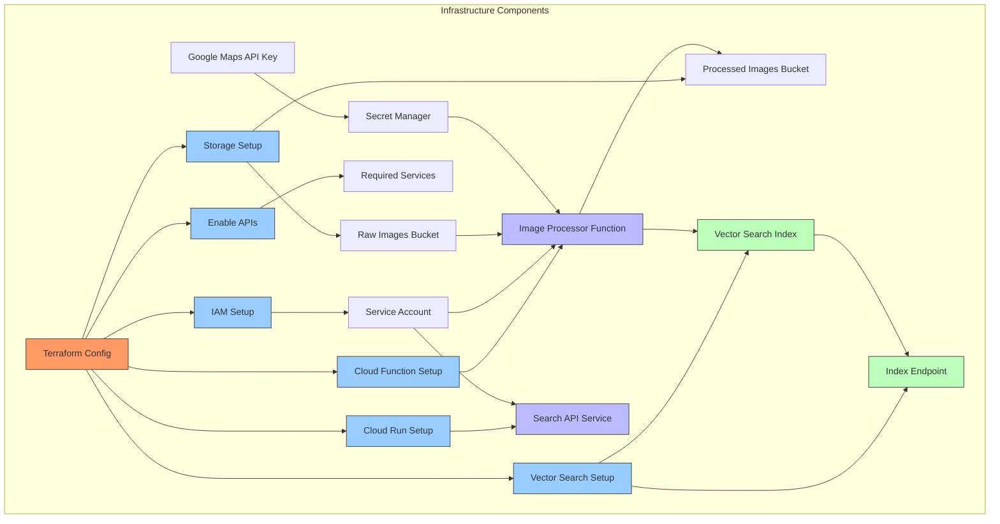

# Infrastructure Architecture

This document describes the infrastructure architecture of the Image Search application deployed on Google Cloud Platform.

## Infrastructure Diagram

## Infrastructure Components

### Core Configuration

1. **Terraform Configuration (`terraform/main.tf`)**
   - Main entry point for infrastructure deployment
   - Orchestrates all component deployments
   - Manages dependencies between resources

### Service Enablement

1. **API Services (`terraform/modules/policy/main.tf`)**
   - Enables required Google Cloud APIs
   - Configures organization policies
   - Sets up service constraints

### Identity and Access Management

1. **IAM Setup (`terraform/modules/iam/main.tf`)**
   - Creates service accounts
   - Assigns IAM roles and permissions
   - Manages security policies

### Storage Resources

1. **Cloud Storage (`terraform/modules/storage/main.tf`)**
   - Raw images bucket for uploads
   - Processed images bucket for analyzed images
   - Function source code bucket

### Vector Search Infrastructure

1. **Vector Search Setup (`terraform/modules/vector_search/main.tf`)**
   - Vertex AI Vector Search index
   - Index endpoint configuration
   - Deployment settings

### Compute Resources

1. **Cloud Functions (`terraform/modules/functions/main.tf`)**
   - Image processor function deployment
   - Event trigger configuration
   - Runtime settings and memory allocation

2. **Cloud Run (`terraform/modules/api_service/main.tf`)**
   - Search API service deployment
   - Container configuration
   - Scaling settings

### Security

1. **Secret Management**
   - Google Maps API key storage
   - Secret access configuration
   - Service account permissions

## Resource Dependencies

1. **Service Account Dependencies**
   - Service accounts must be created before compute resources
   - IAM permissions must be assigned before resource creation

2. **Storage Dependencies**
   - Buckets must exist before function deployment
   - Vector Search index must be created before endpoint

3. **API Dependencies**
   - APIs must be enabled before resource creation
   - Organization policies must be configured first

## Color Legend

- **Orange**: Configuration components
- **Light Blue**: Setup and enablement components
- **Green**: Data storage components
- **Blue**: Compute components

## Deployment Flow

1. **Initial Setup**
   - Enable required APIs
   - Configure organization policies
   - Create service accounts

2. **Resource Creation**
   - Create storage buckets
   - Set up Vector Search infrastructure
   - Deploy compute resources

3. **Service Configuration**
   - Configure endpoints
   - Set up triggers
   - Deploy applications

4. **Security Configuration**
   - Store secrets
   - Configure access
   - Set up IAM policies 