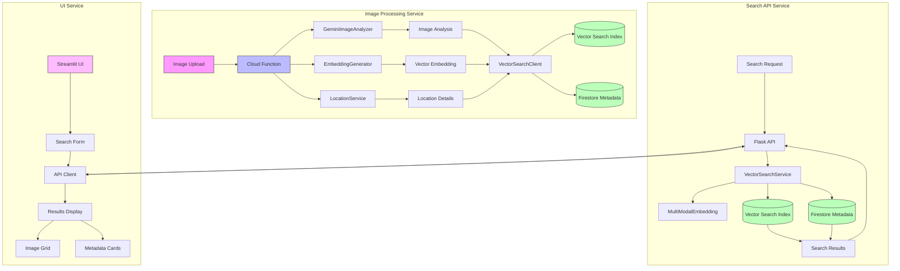

# Source Code Architecture

This document describes the architecture of the Image Search application's source code components and their interactions.

## Component Flow Diagram

## Component Description

### Image Processing Service

The Image Processing Service is responsible for analyzing and processing uploaded images. It consists of several key components:

1. **Cloud Function (`image_processor/main.py`)**
   - Triggered by image uploads to the raw images bucket
   - Orchestrates the image processing workflow

2. **GeminiImageAnalyzer (`image_processor/analyzer.py`)**
   - Uses Google's Gemini Vision model to analyze image content
   - Generates detailed descriptions and object annotations

3. **EmbeddingGenerator (`image_processor/embedding.py`)**
   - Creates vector embeddings from images using Vertex AI
   - Combines visual and textual features for search

4. **LocationService (`image_processor/location_service.py`)**
   - Extracts and validates location information
   - Integrates with Google Maps API for location details

5. **VectorSearchClient (`image_processor/vector_store.py`)**
   - Manages interactions with Vertex AI Vector Search
   - Stores embeddings and metadata in Firestore

### Search API Service

The Search API Service handles search requests and retrieves relevant images:

1. **Flask API (`search_api/main.py`)**
   - Provides RESTful endpoints for image search
   - Handles request validation and response formatting

2. **VectorSearchService (`search_api/vector_search.py`)**
   - Performs vector similarity search
   - Retrieves and combines results from Vector Search and Firestore

### UI Service

The UI Service provides the user interface for the application:

1. **Streamlit UI (`ui_search/app.py`)**
   - Responsive web interface for image search
   - Material Design-inspired components
   - Interactive image grid and metadata display

## Data Flow

1. **Image Upload Flow:**
   - Images are uploaded to the raw images bucket
   - Cloud Function processes the image:
     - Generates image analysis using Gemini
     - Creates vector embeddings
     - Extracts location information
     - Stores data in Vector Search and Firestore
   - Processed image is moved to the processed bucket

2. **Search Flow:**
   - User enters search query in UI
   - Query is sent to Flask API
   - API converts query to vector embedding
   - Vector Search finds similar images
   - Metadata is retrieved from Firestore
   - Results are displayed in UI grid

## Color Legend

- **Pink/Purple**: Entry points and UI components
- **Blue**: Processing and compute components
- **Green**: Storage and database components 